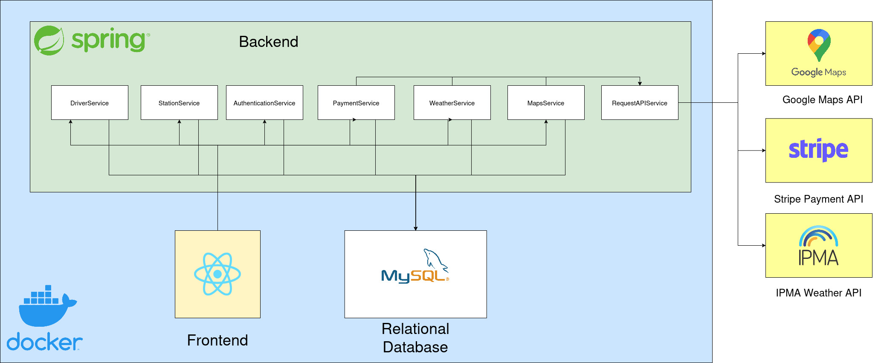

# ChargeUnity
Repository for the TQS project ChargeUnity

## Badges

[](https://sonarcloud.io/summary/new_code?id=ChargeUnity_TQS_ChargeUnity)
[](https://sonarcloud.io/summary/new_code?id=ChargeUnity_TQS_ChargeUnity)
[](https://github.com/ChargeUnity/TQS_ChargeUnity/actions/workflows/ci.yml)
[](https://github.com/ChargeUnity/TQS_ChargeUnity/actions/workflows/deploy.yml)


| Student         | Roles         | Nmec   |
| --------------- | ------------- | ------ |
| Pedro Ponte     | Team Manager | 98059  |
| Miguel Soares Francisco | DevOps Master | 108304 |
| Inês Ferreira | Product Owner | 104415 |
| Alexandre Regalado | QA Engineer     | 124572 |

# Abstract

**ChargeUnity** is an application designed to improve the electric vehicle (EV) charging ecosystem by addressing the challenges of charging services. The project focuses on delivering a seamless experience for EV drivers and station operators through features such as real-time charging station discovery, slot booking, payment integration, and consumption monitoring.

**ChargeUnity** will be built following **Software Quality Assurance** and **DevOps** practices, including **Continuous Integration**, **Continuous Delivery**, and **Continuous Testing**. By applying agile methodologies and a test driven development, the project aims to deliver an efficient product that enhances the EV charging experience.

# Structure

```
.
├── ChargeUnity/                -- Main project folder
│   ├── docker-compose.yml      -- Docker compose file
│   ├──frontend/                -- Frontend source code
│       ├── Dockerfile.frontend -- Dockerfile for the frontend
│   ├──backend/                 -- Backend source code
│       ├── Dockerfile.backend  -- Dockerfile for the backend
│
├── minutes/                    -- Minutes of the meetings
├── presentations/              -- Materials used in the presentations
├── README.md                   -- Context
├── reports/                    -- Project specifications
├── resources/                  -- Images and other resources
```

# Architecture


=======


# Bookmarks
1. [Project Specification & QA Manual](https://github.com/ChargeUnity/TQS_ChargeUnity/tree/develop/reports)
2. [Swagger Documentation](http://192.168.160.8:8080/swagger-ui/index.html)
3. [Observability Dashboard](http://192.168.160.8:3000/d/49c09bb5-2ca7-41fb-8d48-823069eabca7/jvm-micrometer?orgId=1&from=now-24h&to=now&timezone=browser&var-application=&var-instance=backend:8080&var-jvm_memory_pool_heap=$__all&var-jvm_memory_pool_nonheap=$__all&var-jvm_buffer_pool=$__all&refresh=30s)
4. [Static analysis](https://sonarcloud.io/summary/new_code?id=ChargeUnity_TQS_ChargeUnity&branch=main)

## Changes after presentation
Deployment process was fixed and website can now be accessed at [ChargeUnity](http://192.168.160.8:5173/).
Performed load testing with 500 virtual users (K6), confirming application stability and consistent performance under load.

